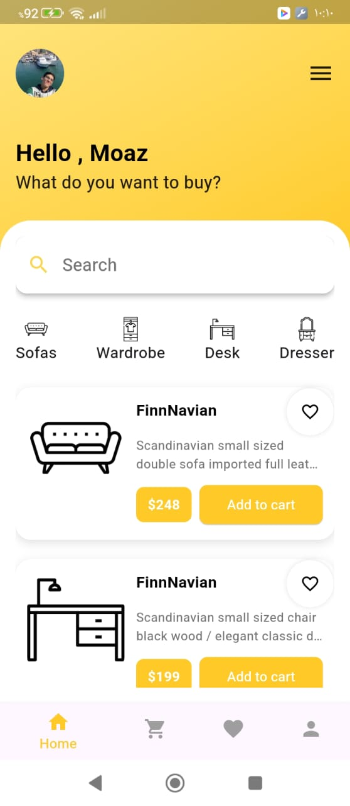
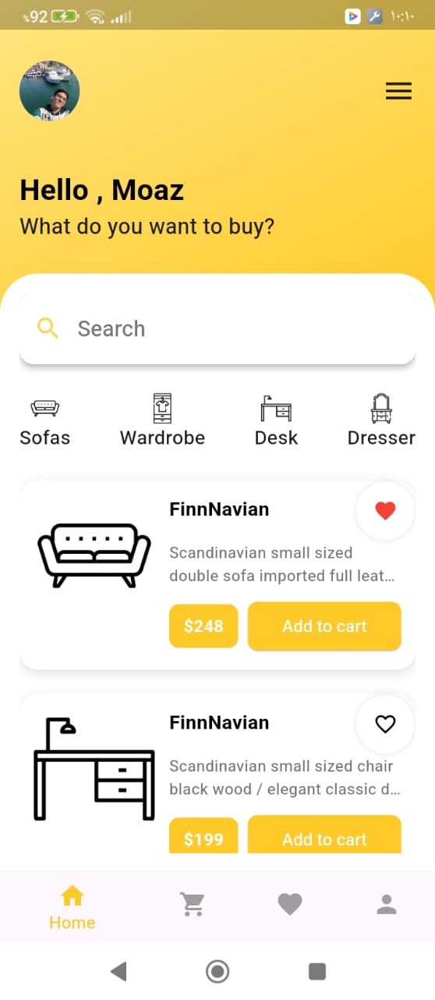
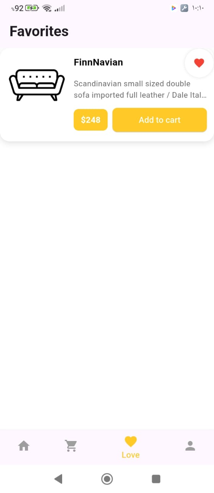
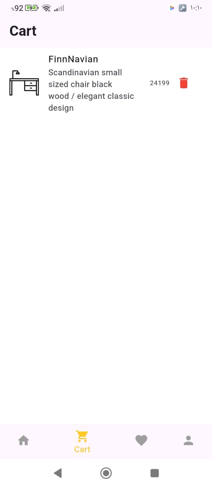

# furniture store App

A clean and modern Flutter demo app for a home furniture store.  
Easily browse products, add them to your favorites or cart, and manage your profile — all with a beautiful UI.

---

##  Screenshots

### 1. Home Page 

*The main page when you first open the app.*

---

### 2. Home Page with Favorite Selected

*After marking a product as favorite (heart icon highlighted).*

---

### 3.  Favorite Page

*After marking a product as favorite (heart icon highlighted).*

---

### 4. Cart Page (with items)

*The cart page after adding products.*

---

### 5. Profile Page

*The user profile page.*

---

## ✨ Features

- Browse a list of home furniture products
- Mark products as favorites (❤️)
- Add products to your cart 🛒
- View and remove items from your cart
- Simple profile page

---


## 📁 Project Structure

```
home_page/
├── Assets/                # App images and icons
├── lib/
│   ├── core/              # App colors, text styles, theme, spacing
│   ├── data/              # Dummy data (e.g., products)
│   ├── models/            # Data models (e.g., Product)
│   ├── pages/             # Main app pages (home, cart, favorites, profile)
│   ├── utils/             # Constants, assets paths, helpers
│   ├── widgets/           # Reusable UI components (ProductCard, SearchBar, etc.)
│   └── main.dart          # App entry point
├── screenshots/           # App screenshots for README
├── pubspec.yaml           # Flutter dependencies and assets
└── README.md              # Project documentation
```


